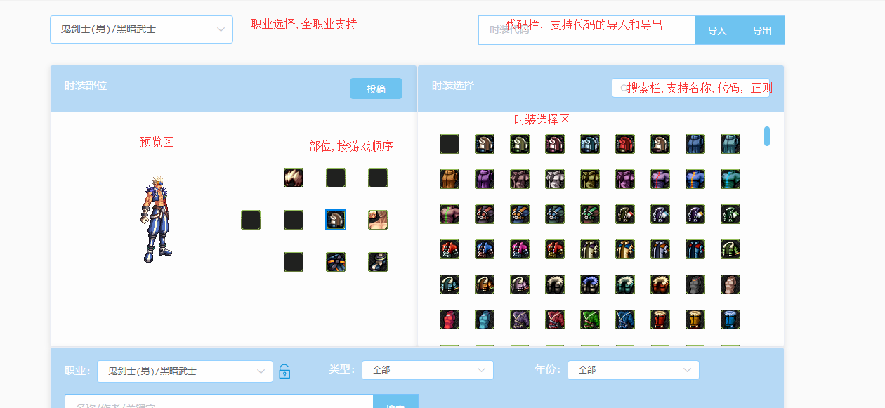
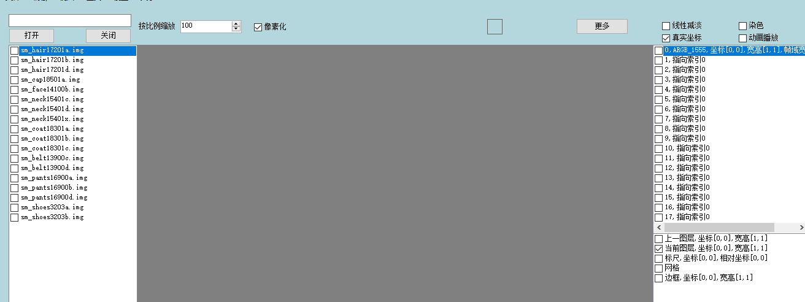
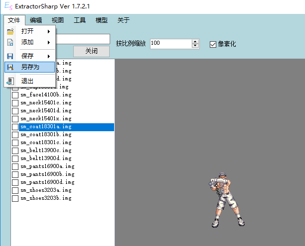

# 时装制作

## 视频
<bili-player aid="24476607" cid="41103340" :page="1"/>

## 图文
本次示例中需要使用到的工具

[ExtractorSharp](../feature/downloads.md)

[ExtractorSharp 纸娃娃](https://kritsu.net/avatar/)

首先打开纸娃娃

找出需要修改的时装，如图是我自身的时装

点击右上角的导出

打开ExtractorSharp,点击模型-试衣间

将代码粘贴到代码输入栏

然后点击载入

点击加入列表

然后重复上述操作,搭配出自己想要修改成的时装

::: tip
如果是现成的IMG文件请跳过这一步
:::

点击加入拼合

选择coat**a.img的文件

右键点击执行拼合

::: tip
已有现成的IMG请直接替换文件
:::

点击拼合

点击右上角文件-另存为

::: tip
文件名请使用s以前的字符开头,并且不带有中文符号
:::

