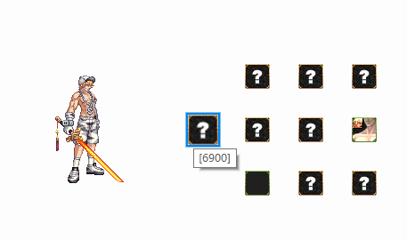
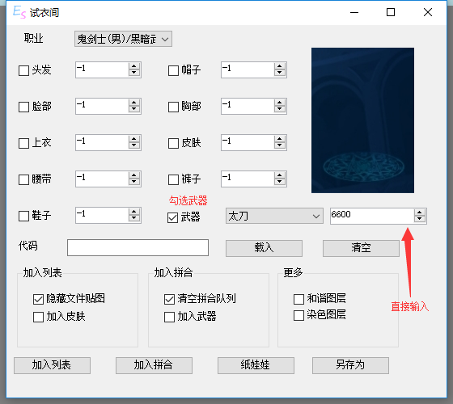
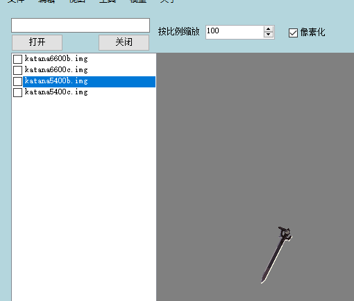
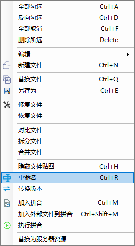
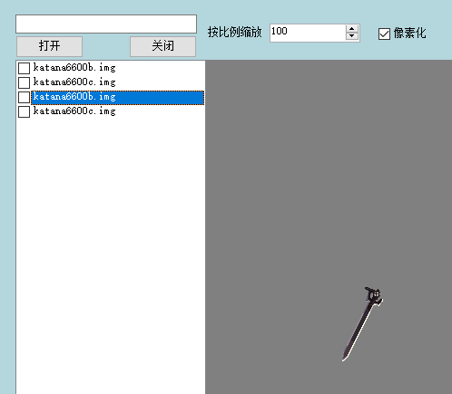
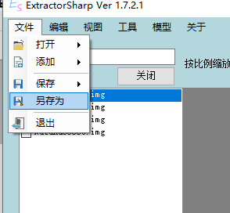

# 武器制作

## 视频

<bili-player aid="25590791" cid="43601841" :page="1"/>

## 图文

本次示例中需要使用到的工具

[ExtractorSharp](../feature/downloads.md)

[ExtractorSharp 纸娃娃](https://avatar.kritsu.net/)

首先打开纸娃娃找出需要修改的武器

::: tip
不需要导出,直接鼠标悬停显示代码
:::

然后打开ExtractorSharp的试衣间

选择武器类型,直接输入代码,勾选武器

然后点击加入列表

重复上述操作,找出想要修改成的武器

取消勾选隐藏贴图

加入列表

根据代码后缀,将新文件名修改为原文件名

删除隐藏的文件

另存为文件

::: tip
文件名请使用s以前的字符开头,并且不带有中文符号
:::

