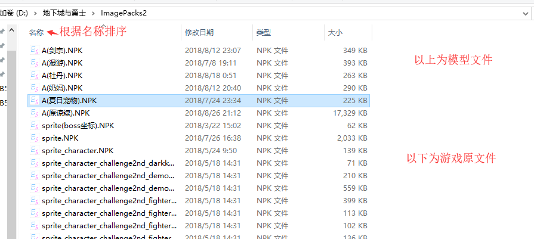
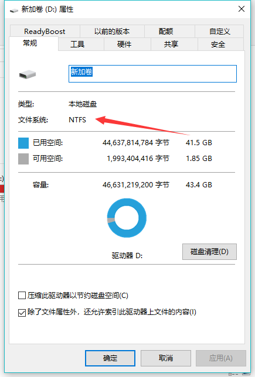

# 模型不生效

## 文件格式

只有NPK格式的文件才能有效使用,其他(例如IMG)格式的文件是无法直接使用的

## 文件命名

模型文件的名称需要在名称排序上较官方文件更前

::: tip
推荐命名方式 A(***).NPK ***表示自定义内容
::: 

## 文件路径

选择你所修改的IMG文件,右键点击重命名

请确保你修改的文件中的IMG文件路径与原文件相同

如果你使用的是时装试衣间/生成器等傻瓜式工具,请确保时装代码无误

如果你使用的是染色时装修改,请[点击此处](../dress/mask-dress.md)

## 分区文件系统

右键文件所在的分区,点击属性

模型文件仅在NTFS文件系统下生效

