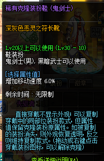

# 克隆及透明装扮的代码

克隆装扮及透明装扮并没有代码

克隆装扮在克隆其他装扮时,其代码即是所克隆装扮的代码

::: tip

例如这件克隆装扮所克隆的是深灰色恶灵之符长靴,则其代码为所克隆装扮的代码

:::

如果克隆装扮没有克隆其他装扮。且该部位有初始装扮或觉醒装扮

其代码即是该初始/觉醒装扮的代码

::: tip

例如这件克隆装扮没有克隆其他装扮,则该装扮的代码为阿修罗的觉醒装扮鞋子

:::

透明装扮同理