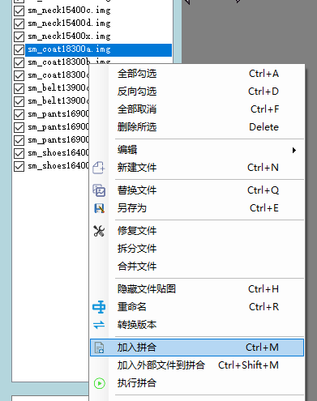

# 拼合文件

::: tip
拼合文件可以将多个文件的贴图拼合到一个文件上
:::

勾选需要拼合的文件,**支持多选**

点击左侧文件列表右键菜单中的**加入拼合**,然后点击**执行拼合**

::: tip
自动排序:默认勾选,打开拼合窗口时自动对拼合队列排序

目标文件:拼合完成后替换的文件,如果文件名在文件列表中不存在，则会新建一个文件

添加文件:添加程序以外的文件到拼合队列中
:::

点击拼合

拼合结果

