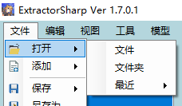
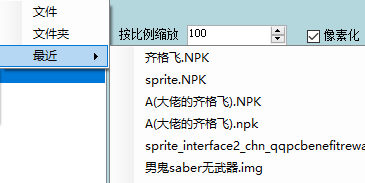
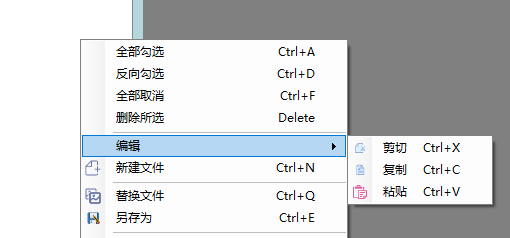

# 打开文件

## 菜单栏打开
 
   点击菜单栏的文件-打开-文件
    
   
   
   右下角可以选择文件类型
   
   
   
在最近选项中,可以选择最近使用过的文件快速打开
    
   
   
## 按钮打开
点击文件列表上方的打开按钮(该方式只能打开,不能添加)
    
   
   
## 拖拽文件
在外部拖拽文件到文件列表(该方式只能添加)

   

## 复制粘贴文件
在系统或其他ES窗口中复制文件

   
   
粘贴到文件列表中

   