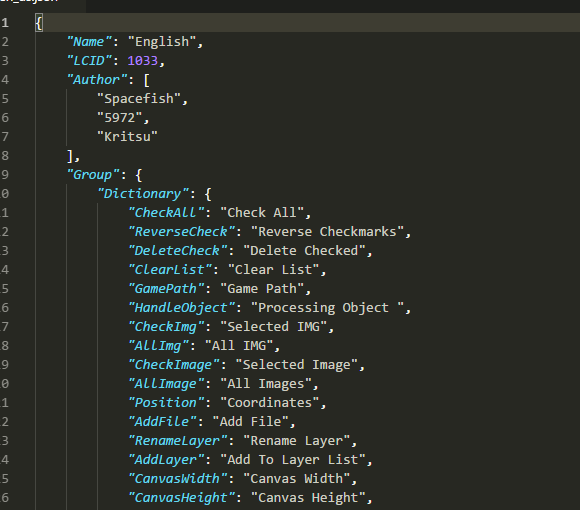

# 语言

ES的标准语言是简体中文,并自带了英文支持

## 切换语言

选择语言,点击下方的确定,重启程序

## 增加其他语言支持

在lan文件夹下,添加一个json文件

结构可以参考英文语言文件

属性 | 意义 
:-: | :-: 
Name | 语言名称
LCID | 地区标识码
Author | 作者
Group | 语言辞典组
Group.Dictionary | 默认的语言辞典