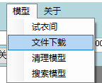
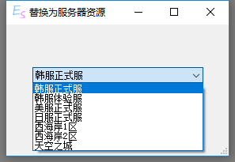
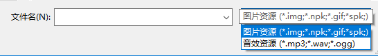

# 文件下载

## 主要功能
下载/替换远程服务器上的资源

文件下载插件包括三个部分

+ 文件下载主体

+ 替换为外服文件功能

+ SPK文件支持

## 使用方法

在菜单栏-插件菜单点击文件下载

### 选择服务器

### 选择文件夹

### 搜索

### 使用方法

在**选择服务器**和**选择文件夹**后，搜索需要查找的文件,选择找到的文件

右键菜单点击**加入列表**或**另存为**

## 替换为外服文件

::: tip
可以直接将文件替换为外服存在的对应文件
:::

选择服务器进行替换

## SPK文件支持

增加对SPK文件的打开支持

