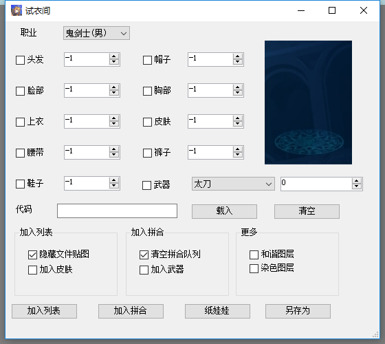
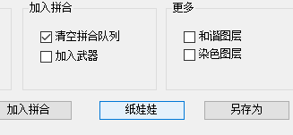
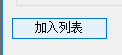
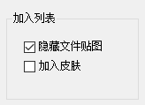
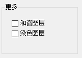

# 试衣间

## 主要功能

根据已知的时装代码,从游戏目录导入文件

## 使用方法

在菜单栏-插件菜单点击试衣间

点击下方的纸娃娃打开纸娃娃

[关于纸娃娃请参考这里](avatar.md)

从纸娃娃拿到代码后。粘贴到代码输入栏上,并点击载入

可以看到代码已经载入

点击加入列表。可以将文件加入到文件列表中

点击加入拼合。可以将文件加入到拼合队列中

另外下面有三个选项组,是进行加入列表或者加入拼合前的设置

### **加入列表**选项组

该选项组仅在加入列表时有效

因为在加入列表时。通常是需要空白的模板。所以默认选择了**隐藏文件贴图**。勾选该选项后,加入列表时会自动对文件进行隐藏贴图处理

而下面的**加入皮肤**。因为模板通常不需要皮肤部位。所以在此排除皮肤文件

### **拼合**选项组

该选项仅在加入拼合时有效

清空拼合队列。是指加入拼合前清空原有的拼合队列

加入武器。因为一般武器不与时装直接拼合。所以在此排除掉武器文件

### 通用选项组

和谐图层是指R18和防血腥暴力的和谐版文件。通常以(tn)或者(18)作为文件名前缀的

通常时装中使用不到,所以这里排除掉

染色图层是指可以使用染色剂染色的时装所使用的文件。通常以_mask为文件名后缀

一般染色剂时装较少。所以这里排除掉

