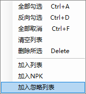

# 文件搜索

## 主要功能

从游戏目录中根据关键字搜索文件

## 使用方法

在菜单栏-插件菜单点击文件搜索

在搜索栏输入关键字进行搜索,搜索结果会出现在下方的列表中

如果有不需要的项，可以通过右键菜单加入忽略列表

选择找到的项,右键菜单加入列表或加入NPK

加入NPK可以将文件所属的NPK整个加入

## 选项

### 使用辞典

辞典可以将关键字替换为对应的关键字进行搜索

并且提供智能提示

关于辞典的查看和编辑,可以通过

**"plugin\D72DF478-FAFF-43DF-B904-9EB338A08B54\conf"**

文件夹下的dictionary.json文件来进行

### 全部匹配

开启这个选项后,搜索结果只会出现与关键字完全相同的文件名

### 占用文件

只搜索被占用的文件

### 忽略模型

只搜索官方文件

### 显示模式

显示所有文件或者只显示文件所属的NPK文件

