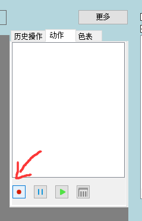
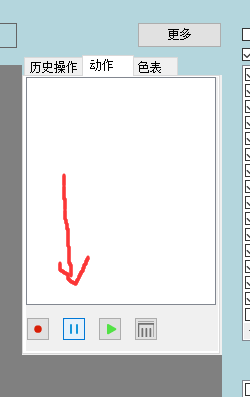
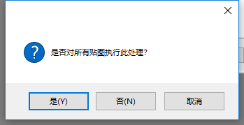
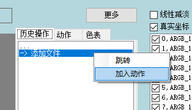
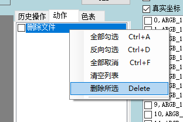
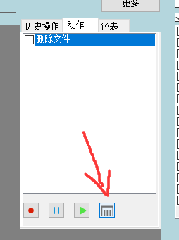

# 动作
::: tip
动作可以将记录的操作批量重复执行
:::

::: warning
动作执行不可撤销。且会清空历史记录
:::

### 录制

点击左下角录制按钮

::: tip
录制开始后，所执行的操作将会被记录到动作中
:::

### 执行

点击下方执行按钮

选择"是",会对所有贴图进行处理

选择"否",会按照勾选贴图进行处理

选择"取消",会取消动作执行

### 加入

打开历史记录,点击右键菜单中的加入动作,可以将历史记录中的操作加入动作

### 删除

选择需要删除的动作

在动作列表中,点击右键菜单中的删除勾选

或者点击下方的删除按钮

