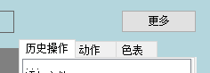
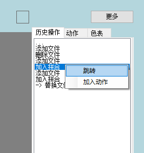

# 历史记录

在进行大部分操作时,操作会被记录下

点击预览区右上角**更多**，选择**历史操作**

### 撤销   
::: tip 
**撤销**可以将上一次进行的操作回撤
:::
快捷键:**Ctrl+Z**

### 重做
::: tip 
**重做**可以恢复上一次撤销的操作
:::
快捷键:**Ctrl+Y**

### 跳转

::: tip
跳转可以将进度跳转到指定的记录上
:::

选择目标记录,点击右键菜单中的跳转

