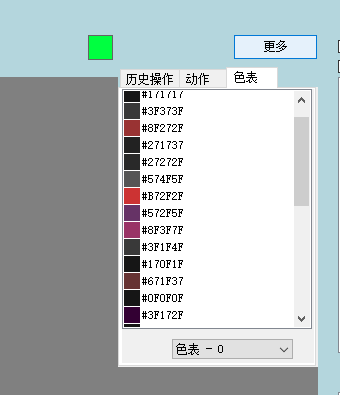
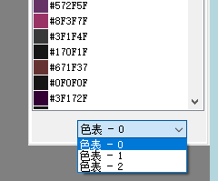

# 调色板操作

## 切换调色板

点击预览区右上角**更多**,选择调色板

当文件存在多个调色板时,在下方下拉框可以选择调色板

右键颜色可以对选中颜色进行编辑

## 拆分文件

::: tip
拆分文件可以将多调色板文件拆分为多个单调色板的文件
:::

选中需要拆分的文件,**支持多选**

点击左侧文件列表右键菜单中的拆分文件

拆分前

拆分后

## 合并文件

::: tip
合并文件是拆分文件的逆向操作,可以将多个带调色板的文件合并为一个文件,并使用第一个文件的索引
:::

选中需要合并的文件,**支持多选**

点击左侧文件列表右键菜单中的合并文件

合并前

合并后

