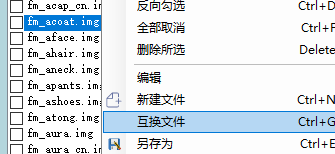

# 替换文件

## 替换为外部文件
    
::: tip  
**替换为外部文件**是将文件列表中的文件替换为外部文件,并且**使用原文件的路径**
:::

勾选需要删除的文件,**不支持多选**

点击左侧文件列表右键菜单中的替换文件

文件选择框右下角可以选择文件类型

## 列表内替换

::: tip
**列表内替换**是在文件列表中替换
:::

选择需要替换为的文件,右键加入替换

选择需要被替换的文件,右键替换到该文件

::: tip

如果直接点击**替换到该文件**,则默认为最上的选项

也可以直接点击右侧列表的选项替换

:::

## 互换文件

::: tip
互换文件是指可以将文件列表内的两个文件互换。且文件路径不变
:::

选择需要互换的文件,右键点击互换文件

然后找到需要互换的另一个文件,重复上一步操作