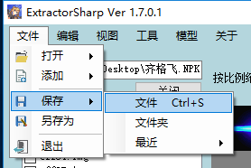
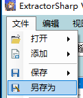
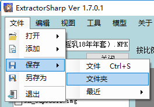

# 保存文件

## 菜单栏保存(NPK)

点击菜单栏的文件-保存-文件

   
程序会将文件列表中的所有文件打包为NPK文件

并保存到文件列表上方的保存路径栏中

## 另存为(NPK)
点击菜单栏的文件-另存为可以自行选择路径保存

## 保存至文件夹(IMG)
点击菜单栏的文件-保存-文件夹

可以将文件列表中的所有文件保存到目标文件夹中

## 另存为(IMG)
选中需要保存的文件

点击左侧文件列表呼出右键菜单中的另存为

如果是单个文件，则可以选择目标文件名和文件格式

如果是多个文件。则会以IMG格式,以及文件原名保存至目标文件夹

