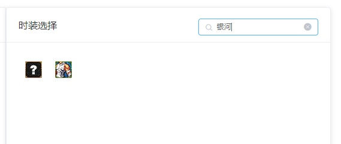

# 纸娃娃

纸娃娃系统是试衣间插件的一部分

是一个无需下载的web程序。[访问地址](https://kritsu.net/avatar)

上方是职业选择和代码导入导出栏

下方左侧是预览区,右侧是选择区

## 选择职业

在左上角可以选择职业

::: warning
选择职业时。会清空已选择的时装
:::

## 选择部位

点击预览区右侧的九宫格中的格子可以选择部位

每一个格子代表一个部位。顺序与游戏中一致

## 选择时装

点击选择区中的时装图标

## 搜索时装

右上角可以通过输入关键字搜索时装

::: tip
搜索支持多关键字。使用空格分隔

搜索支持正则表达式
:::

## 导出

选好时装后,点击右上角的导出按钮。代码会自动粘贴到剪贴板

## 推荐

