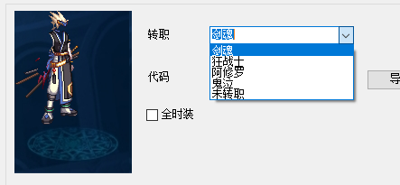
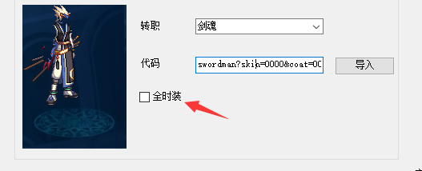
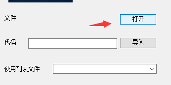
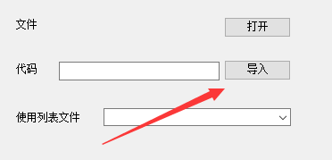
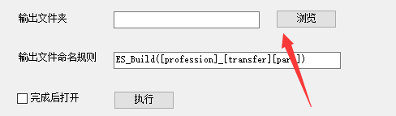

# 生成器

ExtractorSharp Builder是一个傻瓜式时装生成器

可以用于生成无时装(即觉醒装扮或默认装扮)、全时装,以及自定义时装适用的补丁

支持IMG文件、时装代码两种模式的导入

## 概览

## 关于使用

首先打开ExtractorSharp.exe

在左上角选择职业

然后导入自身时装

::: tip
以下三种方式请根据自身情况选择
:::

- 如果你的时装是无时装(即觉醒装扮或默认装扮),请在此处选择转职或者未转职

::: tip
如果在此处没有找到你的职业,或者代码有误,请前往纸娃娃自行查找
:::

- 如果你的时装是其他时装(包括但不限于各类节日套装、稀有套装、散搭时装)

你先在[ExtractorSharp 纸娃娃系统](../plugin/avatar.md)导出你的时装代码

然后输入代码并点击导入

- 如果你需要做全时装补丁(即替换同职业所有时装),那么你可以勾选这个

然后导入你需要替换为的时装

::: tip
以下三种方式请根据自身情况选择
:::

如果你已经有了一个拼合好的IMG文件。请点击打开

如果你有一套时装搭配的代码([ExtractorSharp 纸娃娃](../plugin/avatar.md)格式)

请输入代码并点击导入

选择输出目录,你可以直接选择游戏文件夹下的ImagePacks2目录,这样补丁就直接安装了

在这里可以设置输出文件名。文件名的格式请按照[**此文**](../../faq/basic/mod-invalid.md),否则可能导致文件无效

最后点击执行

## 选项注解

::: tip
所有的选项都是适用于通常情况默认选择。请不要随意修改
:::

### 全时装
勾选全时装后。将会对该职业全部时装生效。游戏里同职业的所有角色都会生效

### 替换到皮肤
当某些文件动作与皮肤不吻合时。勾选该选项。其他情况则不需要勾选

### 染色图层
对可染色且已染色的时装生效

### 目标文件
表示替换的文件。如果出现了武器穿模的情况,请尝试调整该选项。

### 输出文件命名规则
表示输出文件的名称规则。可以携带4个参数,分别是
- profession : 职业
- transfer : 转职
- name : 原始文件名
- part : 部位

参数通过\[**\]的形式表示。在生成时。参数会被自动替换掉

::: tip
如果制作全时装时,不携带part或name参数。则会自动整合到同一文件
:::

### 代码导入

代码的格式固定为

职业?部位0=代码0&部位1=代码1

例如swordman?coat=0000&pants=0000

在[**纸娃娃**](avatar.md)可以导出此类代码