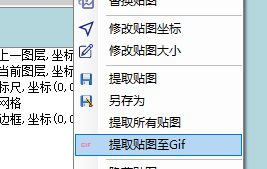

# 提取贴图

## 另存为单个贴图

选择需要提取的贴图,**不支持多选**

点击右侧贴图列表右键菜单中的另存为

选择保存路径

## 提取多个贴图

选择需要提取的贴图,**支持多选**

点击右侧贴图列表右键菜单中的提取贴图

选择贴图保存路径

::: tip
自动递增是贴图保存的文件名的前缀。

如果自动递增末尾是数字,则会按文件顺序递增。

勾选所有贴图,可以将文件中的所有贴图提取到目标文件夹
:::

提取的图片文件会保存到目标文件夹下和IMG同名的文件夹中

## 提取至GIF

点击右侧贴图列表右键菜单中的提取至GIF,可以将所选的贴图提取到目标GIF文件中

